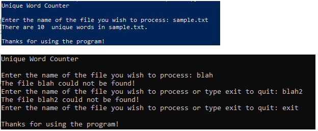

## Unique Words

### Instructions:
 
- Create a Python program that will count the number of unique words in a file. The program should prompt the user for the name of a file to open. The program should verify that the file exists prior to opening it and if it doesn’t exist the user should be given the option to exit the program or try again. After the file is opened read each word in the file into a set then use that data in the set to calculate and display the number of unique words in the file.
  - The file used to generate the sample output is included in the repo. You should also test with additional files.
- Enter your name, the lab number, and the current date into a set of comments at the top of the code.	
- Push the program source code to the assignment repo. 

### Example Output

### Grading:
2 – General, compiles, comments, proper indentation, etc    
4 - File open logic  
4 - Reading the file into a set    
4 - Unique word calculation and output
